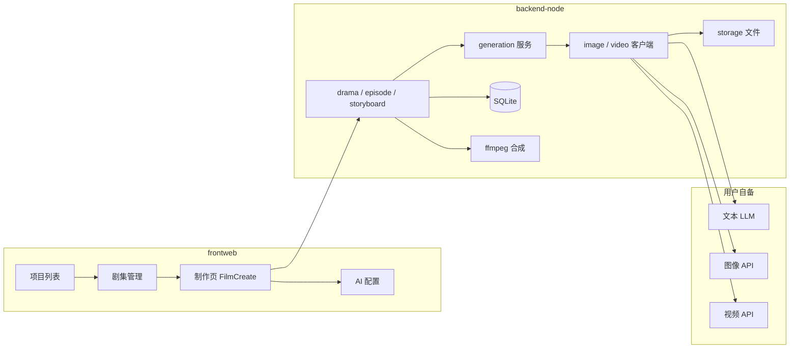

# 视频miao~ 项目概览

> 本地 AI 短剧 / 漫剧生成工具 · 当前版本 **v1.2.6**  
> 一句话：**数据在本机、接入自有 AI API、从剧本到成片一条龙。**

---

## 1. 项目定位

| 维度 | 说明 |
|------|------|
| **产品** | 视频miao~（视频miao~） |
| **核心价值** | 离线/本地运行、素材不上云、开源可二次开发 |
| **用户** | 内容创作者、隐私敏感用户、想接自家模型的开发者 |
| **许可** | MIT |

与多数云端 SaaS 短剧工具不同：本项目强调 **SQLite 本地库 + 本地文件存储 + 用户自备 API Key**。

---

## 2. 技术架构

```
┌─────────────────────────────────────────────────────────────┐
│  用户界面                                                     │
│  frontweb (Vue 3 + Vite + Element Plus + Pinia)              │
│  路由：项目列表 / 剧集管理 / 制作页 / AI配置 / 素材库           │
└──────────────────────────┬──────────────────────────────────┘
                           │ HTTP  /api/v1  (+ /static)
┌──────────────────────────▼──────────────────────────────────┐
│  backend-node (Express + better-sqlite3)                     │
│  · REST API · 异步任务 · AI 调用封装 · ffmpeg 合成             │
│  · 配置：configs/config.yaml                                  │
│  · 数据：SQLite + storage 目录                                │
└──────────────────────────┬──────────────────────────────────┘
                           │ 可选打包
┌──────────────────────────▼──────────────────────────────────┐
│  desktop (Electron 28)                                       │
│  内嵌后端 + 构建后的 frontweb/dist → Windows/Mac 便携 exe     │
└─────────────────────────────────────────────────────────────┘
```

| 层级 | 技术栈 | 说明 |
|------|--------|------|
| 前端 | Vue 3、Vite 5、Element Plus、Pinia、Axios | 纯 JavaScript，无 TypeScript |
| 后端 | Node.js ≥18、Express、better-sqlite3 | 单体 API 服务 |
| 桌面 | Electron 28、electron-builder | 复制 `backend-node` → `backend-app` 后打包 |
| 存储 | SQLite + 本地 `storage` 目录 | 图片/视频/工程 ZIP |
| 多媒体 | ffmpeg（工具目录内置）、sharp | 视频合并、四宫格切图等 |

**默认端口**

| 服务 | 端口 | 说明 |
|------|------|------|
| 后端 API | `5679` | `config.yaml` 中 `server.port` 可改 |
| 前端开发 | `3013` | Vite 将 `/api`、`/static` 代理到后端 |
| 生产/打包 | 同后端 | 后端可直接托管 `frontweb/dist` 静态资源 |

---

## 3. 目录结构（开发时）

```
视频miao~/
├── backend-node/           # 核心后端
│   ├── src/
│   │   ├── server.js       # 入口
│   │   ├── app.js          # Express 应用、静态资源、迁移
│   │   ├── routes/         # REST 路由（21 个模块）
│   │   ├── services/       # 业务与 AI 调用（40+ 服务）
│   │   ├── db/             # SQLite 连接与 migrate
│   │   └── config/         # YAML 配置加载
│   ├── migrations/         # 数据库版本迁移（01–22）
│   ├── configs/            # config.yaml（勿提交密钥）
│   └── tools/ffmpeg/       # Windows 内置 ffmpeg
├── frontweb/               # Web 前端
│   └── src/
│       ├── views/          # 6 个主页面
│       ├── api/            # 后端 API 封装
│       ├── components/     # 通用组件
│       └── composables/    # 组合式逻辑（主题、制作页等）
├── desktop/                # Electron 壳与打包脚本
├── docs/                   # 用户/开发文档
├── example_drama/          # 示例工程（标准版打包带入）
├── openclaw-skill/         # OpenClaw 技能说明
├── 各大平台中转站配置/      # 第三方 API 中转配置示例 JSON
└── run_dev.bat             # Windows 一键启前后端
```

---

## 4. 核心业务模型

数据以 **短剧项目（drama）** 为中心，向下展开：

```
dramas（项目）
  ├── episodes（分集 / 剧本）
  │     └── storyboards（分镜）
  │           ├── image_generations（分镜图）
  │           └── video_generations（分镜视频）
  ├── characters（角色）
  ├── scenes（场景）
  ├── props（道具）
  └── video_merges（整集合成视频）

横切能力：
  · character_libraries / scene_libraries / prop_libraries（全局素材库）
  · ai_service_configs（文本/图片/视频 AI 配置）
  · async_tasks（长任务：生成、导入、一键流水线等）
  · assets（统一媒体资产）
  · prompt_overrides（自定义提示词）
```

**创作流水线（典型顺序）**

1. 创建项目 → 设定画幅比例、风格  
2. **故事/剧本**：梗概生成或多集剧本、小说导入  
3. **角色 / 场景 / 道具**：AI 提取 + 生图  
4. **分镜**：按集生成分镜脚本（景别、运镜、台词、解说旁白等）  
5. **分镜图 / 分镜视频**：逐镜或批量生成  
6. **合成**：ffmpeg 合并为整集视频；可导出工程 ZIP  

**两种分镜视频模式（v1.2.5+）**

| 模式 | 说明 | 典型接口规范 |
|------|------|----------------|
| 经典分镜 | 中间为参考图 + 结构化视频提示词 | 各厂商常规图生视频 |
| 全能模式 | `universal_segment_text` + `@图片1`… 多图参考 | `volcengine_omni`、`kling_omni` |

---

## 5. 前端页面与路由

| 路径 | 组件 | 职责 |
|------|------|------|
| `/` | `FilmList.vue` | 项目列表、新建、导入导出入口 |
| `/drama/:id` | `DramaDetail.vue` | 分集、角色/场景/道具库、进制作页 |
| `/film/:id` | `FilmCreate.vue` | **主工作台**：剧本、分镜、生成、一键流水线 |
| `/ai-config` | `AiConfig.vue` | 文本/图/视频模型配置与测试 |
| `/media-library` | `MediaLibrary.vue` | 跨项目媒体素材 |
| `/free-create` | `FreeCreate.vue` | 自由创作入口 |

状态管理以 **Pinia + 页面内 composables** 为主（如 `filmCreate/useCharacters.js` 等）。

---

## 6. 后端 API 分组（前缀 `/api/v1`）

| 模块 | 代表路径 | 功能 |
|------|----------|------|
| dramas | `GET/POST /dramas`, `.../export`, `.../import` | 项目 CRUD、ZIP 导入导出、小说导入 |
| generation | `POST /generation/story`, `/generation/characters` | 故事生成、角色批量生成 |
| episodes | `POST /episodes/:id/storyboards` | 分镜生成、定稿、下载成片 |
| storyboards | `PUT /storyboards/:id`, 全能提示词流式接口 | 分镜编辑、参数推断、放大 |
| characters / scenes / props | 各实体 CRUD + `generate-image` | 资源与 AI 生图 |
| images / videos | 批量、单镜生成 | 图片/视频任务 |
| video-merges | 合成任务 | 整集视频合并 |
| ai-configs | CRUD + `test` | 多厂商 AI 配置 |
| *-library | character/scene/prop-library | 全局素材库 |
| tasks | `GET /tasks/:task_id` | 异步任务轮询 |
| settings / settings/prompts | 语言、生成参数、提示词覆盖 | |
| upload | `POST /upload/image` | 上传 |
| health | `GET /health` | 健康检查 |

统一响应格式：`{ success, data, error }`（前端 `request.js` 自动解包 `data`）。

---

## 7. 关键服务层（backend-node/src/services）

| 服务 | 职责 |
|------|------|
| `aiClient.js` | 文本 LLM 调用、JSON 提取、图片描述 |
| `imageClient.js` / `imageService.js` | 多厂商文生图、参考图、四宫格拆分 |
| `videoClient.js` / `videoService.js` | 图生视频、Seedance/Kling 等协议 |
| `storyGenerationService.js` | 梗概 → 多集剧本 |
| `episodeStoryboardService.js` | 分集 → 分镜 JSON（含 narration） |
| `characterGenerationService.js` | 角色提取与生图任务 |
| `videoMergeService.js` | ffmpeg 合成 |
| `dramaExportService.js` / `dramaImportService.js` | 工程 ZIP |
| `novelImportService.js` | 小说/长文 → 分章分集 |
| `taskService.js` | 异步任务状态机 |
| `aiConfigService.js` | AI 配置与厂商锁定 |
| `promptOverridesService.js` + `promptI18n.js` | 可覆盖的提示词模板 |

新增 AI 厂商时，通常改 **`aiClient` / `imageClient` / `videoClient`** 与 **`aiConfig` 路由**，并在前端 AI 配置页增加协议选项。

---

## 8. AI 能力一览

三类模型在 **AI 配置页独立配置**（可不同厂商）：

| 类型 | 用途 |
|------|------|
| 文本 | 剧本、分镜脚本、提示词润色、JSON 结构化输出 |
| 图片 | 角色、场景、道具、分镜静帧 |
| 视频 | 分镜片段 |

**已对接（节选）**

- 阿里云 DashScope（通义）：文本 / 图 / 视频  
- 火山引擎（豆包、Seedance 1.x / **2.0 多图**）  
- 可灵 Kling（含 Omni）  
- Google Gemini、Vidu、NanoBanana 等  
- 任意 **OpenAI 兼容** 文本接口（Ollama、DeepSeek 等）  

详细 Key 申请与字段说明见：[configuration.md](./configuration.md)。

---

## 9. 配置与数据落盘

**配置文件**

- 开发：`backend-node/configs/config.yaml`（从 `config.example.yaml` 复制）  
- 桌面版：`%APPDATA%\localminidrama-desktop\backend\configs\config.yaml`（Windows）

常见配置项：`server`、`database.path`、`storage.local_path`、各 AI 默认项。

**数据库**

- SQLite 文件路径由 `database.path` 指定  
- 启动时自动执行 `migrations/*.sql`（版本 01–22）  
- 手动迁移：`cd backend-node && npm run migrate`

**媒体文件**

- 默认在 `storage` 目录（相对路径会按 `process.cwd()` 解析）  
- 通过 `/static/...` 对外提供访问  

---

## 10. 本地开发快速启动

```bash
# 环境：Node.js >= 18

# 后端
cd backend-node
npm install
cp configs/config.example.yaml configs/config.yaml   # 编辑 API
npm run migrate    # 首次
npm start          # http://localhost:5679

# 前端（新终端）
cd frontweb
npm install
npm run dev        # http://localhost:3013
```

Windows 可双击根目录 **`run_dev.bat`**（会自动杀占用的 5679 端口并开两个窗口）。

**Electron 开发**

```bash
cd desktop
npm install
npm start          # 会拉起内嵌后端 + 窗口
```

---

## 11. 打包与发布

| 产物 | 命令/位置 |
|------|-----------|
| Windows exe | `desktop/` 下 `npm run dist` / `dist:cn` |
| Mac | `dist-mac.sh` / `electron-builder-mac.json` |
| 前端静态资源 | `frontweb/npm run build` → 由 desktop 脚本复制到 `frontweb-dist` |

标准版内置 **example_drama** 示例项目；Lite 版不含示例、体积更小。

---

## 12. 扩展与二次开发建议

| 目标 | 建议入口 |
|------|----------|
| 新页面/流程 | `frontweb/src/views` + `router/index.js` |
| 新 API | `backend-node/src/routes` + `services` |
| 新 AI 厂商 | `imageClient` / `videoClient` + `routes/aiConfig.js` |
| 数据库字段 | 新增 `migrations/NN_xxx.sql`，勿改已发布迁移 |
| 提示词 | `services/promptI18n.js` 或用户侧「高级设置」覆盖 |
| 桌面行为 | `desktop/main.js`（端口、userData、后端路径） |

**代码风格**：全项目 JavaScript；前后端均用 CommonJS（后端）/ ESM（前端 Vite）；错误与日志走后端 `logger` + 前端 `ElMessage`。

---

## 13. 相关文档索引

| 文档 | 内容 |
|------|------|
| [README.md](../README.md) | 功能介绍、截图、版本亮点 |
| [quickstart.md](./quickstart.md) | 详细安装、Docker、打包 |
| [configuration.md](./configuration.md) | AI 服务商配置 |
| [story.md](./story.md) | 作者背景与产品动机 |
| [en.md](./en.md) | 英文说明 |
| [CHANGELOG.md](../CHANGELOG.md) | 版本更新记录 |

---

## 14. 架构示意（创作数据流）



---

*文档根据仓库 v1.2.6 代码结构整理，若与运行环境有出入，以 `config.yaml` 与实际迁移为准。*
